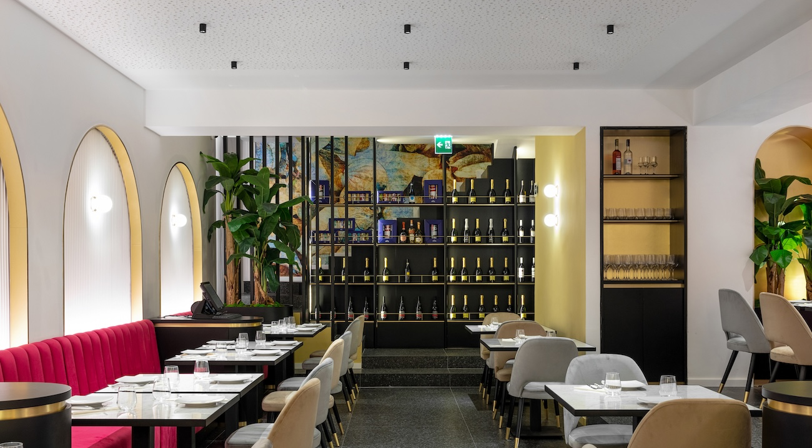

# Restaurant 🔥

## Restaurant è una piattaforma digitale per la gestione e presentazione di siti vetrina per ristoranti.

<div align="center">
   
</div> 

---

### Caratteristiche: 

- Facile da configurare e utilizzare
- Gratuito e Open Source
- Senza dipendenze da framework aggiuntivi
- Struttura multipagina
- Design completamente reattivo
- Prestazioni elevate e ottimizzazione SEO

---

### Tecnologie Utilizzate: 

- HTML
- CSS
- JavaScript ( AOS )

---

### STEP 1 - Homepage:  

Accedi a `/index.html` e personalizza le tue informazioni inserendo i dati della tua attività. La struttura comprende otto sezioni.

### Sezione: 

- Sostituisci l'immagine in `.main-nav__brand-logo-cont` con il tuo logo. È consigliabile utilizzare un'immagine con sfondo trasparente, così da armonizzarla con il colore del progetto. Per rimuovere lo sfondo, puoi utilizzare strumenti come [Remove.bg](https://www.remove.bg/it), caricando la tua immagine per un'elaborazione automatica.

```html
<!-- INIZIO Sezione -->
    <section>
      <nav class="main-nav">
        <div class="main-container main-nav--main-container">
          <div class="main-nav__brand-logo-cont">
            
          </div>
          <span class="main-nav__sm-scr-menu-icon-cont nav-menu">
            
          </span>
        </div>
      </nav>
      <div class="fl-scr-menu none">
        <div class="main-container">
          <div class="icon-cont menu-close">
            
          </div>
          <ul class="links">
            <li class="heading link">
              <a href="./index.html"> Home </a>
            </li>
            <li class="heading link">
              <a href="./menu.html"> Menu </a>
            </li>
            <li class="heading link">
              <a href="./about.html"> About </a>
            </li>
            <li class="heading link">
              <a href="./contact.html"> Contact </a>
            </li>
          </ul>
        </div>
      </div>
    </section>
<!-- FINE Sezione -->
```

### Header: 

- Modifica il testo all'interno della classe `.heading heading-primary home-header--heading-primary` per inserire il nome della tua attività.
- Personalizza il testo nella classe `.text text-primary home-header--text-primary` per aggiungere lo slogan o la mission della tua attività.

```html
<!-- INIZIO Header -->
    <header class="home-header">
      <div class="content">
        <div data-aos="fade-up">
          <h1 class="heading heading-primary home-header--heading-primary"> Da Mario </h1>
          <p class="text text-primary home-header--text-primary">
            Lorem ipsum dolor sit amet consectetur adipisicing elit. <br />
            Hic facilis tempora, explicabo quae quod deserunt eius sapiente
            praesentium.
          </p>
          <a class="btn home-header--btn" href="#"> Order Online </a>
        </div>
      </div>
      <span class="scroll-btn">
        <a href="#">
          <span class="mouse">
            <span> </span>
          </span>
        </a>
      </span>
    </header>
<!-- FINE Header -->
```

### Sezione Greetings: 

- Modifica il titolo all'interno della classe `.heading-secondary__sm` con il testo che desideri.
- Aggiungi una breve descrizione nella sezione `.text-secondary`.
- Sostituisci l'immagine nella classe `.greetings__visual-img-cont` con un'immagine rappresentativa della tua attività.

```html
<!-- INIZIO Sezione Greetings -->
    <section class="greetings">
      <div class="main-container greetings--main-container" data-aos="fade-up">
        <div class="greetings__msg">
          <h2 class="heading heading-secondary greetings--heading-secondary">
            <span class="heading-secondary__sm"> Why us </span><br />
            Serving you great time
          </h2>
          <p class="text-secondary">
            Lorem ipsum dolor sit amet consectetur adipisicing elit. Hic facilis tempora, explicabo quae quod 
            deserunt eius sapiente praesentium.
          </p>
          <a href="./about.html" class="btn greetings--btn"> Out Story </a>
        </div>
        <div class="greetings__visual">
          <div class="greetings__visual-img-cont">
            
          </div>
        </div>
      </div>
    </section>
<!-- FINE Sezione Greetings -->
```

### Sezione Menu Features: 

- Aggiungi dei titoli nelle classi `.menu-features__feature-name`.
- Inserisci delle brevi descrizioni nelle classi `.menu-features__feature-desc` per introdurre ciascuna sezione.

```html
<!-- INIZIO Sezione Menu Features -->
    <section class="menu-features">
      <div class="main-container" data-aos="fade-up">
        <h2 class="heading heading-secondary">
          <span class="heading-secondary__sm"> Discover </span><br />
          <span class="heading-secondary__bg"> Menu Features </span>
        </h2>
        <div class="menu-features__row">
          <div class="menu-features__feature">
            <div class="menu-features__icon-cont">
              
            </div>
            <h5 class="menu-features__feature-name"> Always Fresh </h5>
            <p class="menu-features__feature-desc">
              Lorem ipsum dolor sit amet consectetur 
              adipisicing elit. Hic facilis tempora, explicabo 
              quae quod deserunt eius sapiente praesentium.
            </p>
          </div>
          <div class="menu-features__feature">
            <div class="menu-features__icon-cont">
              
            </div>
            <h5 class="menu-features__feature-name"> Amazing Taste </h5>
            <p class="menu-features__feature-desc">
              Lorem ipsum dolor sit amet consectetur 
              adipisicing elit. Hic facilis tempora, explicabo 
              quae quod deserunt eius sapiente praesentium.
            </p>
          </div>
          <div class="menu-features__feature">
            <div class="menu-features__icon-cont">
              
            </div>
            <h5 class="menu-features__feature-name"> Premium Ingredients </h5>
            <p class="menu-features__feature-desc">
              Lorem ipsum dolor sit amet consectetur 
              adipisicing elit. Hic facilis tempora, explicabo 
              quae quod deserunt eius sapiente praesentium.
            </p>
          </div>
        </div>
        <a href="./menu.html" class="btn"> See Menu </a>
      </div>
    </section>
<!-- FINE Sezione Menu Features -->
```

### Sezione Testimonial: 

- Aggiungi brevi recensioni dei tuoi clienti nelle classi `.testimonial__review`.
- Inserisci il nome del cliente nelle classi `.heading-secondary` e la sua professione nelle classi `.testimonial__prof`.

```html
<!-- INIZIO Sezione Testimonial -->
    <section class="testimonial">
      <div class="main-container" data-aos="fade-up">
        <h2 class="heading heading-secondary">
          <span class="heading-secondary__sm"> Our </span><br />
          <span class="heading-secondary__bg"> Clients </span>
        </h2>
        <div class="testimonial__testimonials-cont">
          <div class="testimonial__single-testimonial">
            <div class="quotes-icon-cont">
              
            </div>
            <p class="testimonial__review"> 
              Lorem ipsum dolor sit amet consectetur 
              adipisicing elit. Hic facilis tempora, explicabo 
              quae quod deserunt eius sapiente 
              praesentium.
            </p>
            <h3 class="heading-secondary"> Alessandro </h3>
            <h4 class="testimonial__prof"> Lawyer </h4>
          </div>
          <div class="testimonial__single-testimonial">
            <div class="quotes-icon-cont">
              
            </div>
            <p class="testimonial__review">
              Lorem ipsum dolor sit amet consectetur 
              adipisicing elit. Hic facilis tempora, explicabo 
              quae quod deserunt eius sapiente 
              praesentium.
            </p>
            <h3 class="heading-secondary"> Leonardo </h3>
            <h4 class="testimonial__prof"> Architect </h4>
          </div>
          <div class="testimonial__single-testimonial">
            <div class="quotes-icon-cont">
              
            </div>
            <p class="testimonial__review">
              Lorem ipsum dolor sit amet consectetur 
              adipisicing elit. Hic facilis tempora, explicabo 
              quae quod deserunt eius sapiente 
              praesentium.
            </p>
            <h3 class="heading-secondary"> Aurora </h3>
            <h4 class="testimonial__prof"> Dentist </h4>
          </div>
        </div>
        <a href="./about.html" class="btn"> Read more </a>
      </div>
    </section>
<!-- FINE Sezione Testimonial -->
```

### Sezione Gallery: 

- Sostituisci le immagini presenti nella classe `.images-cont` con fotografie rappresentative della tua attività.

```html
<!-- INIZIO Sezione Gallery -->
    <section class="gallery">
      <div class="main-container gallery--main-container" data-aos="fade-up">
        <h2 class="heading heading-secondary">
          <span class="heading-secondary__sm"> Our </span><br />
          <span class="heading-secondary__bg"> Shots </span>
        </h2>
        <div class="images-cont">
          <div class="img-cont i1">
            
          </div>
          <div class="img-cont i2">
            
          </div>
          <div class="img-cont i3">
            
          </div>
          <div class="img-cont i4">
            
          </div>
          <div class="img-cont i5">
            
          </div>
          <div class="img-cont i6">
            
          </div>
          <div class="img-cont i7">
            
          </div>
        </div>
      </div>
    </section>
<!-- FINE Sezione Gallery -->
```

### Sezione Map: 

- Aggiungi l'indirizzo della tua attività nella classe `.text`.

```html
<!-- INIZIO Sezione Map -->
    <section class="map home--map">
      <div class="info">
        <h2 class="heading heading-secondary">
          <span class="heading-secondary__sm"> Find us </span><br />
          <span class="heading-secondary__bg"> Our Address </span>
        </h2>
        <div class="address">
          <span class="icon-cont">
            
          </span>
          <p class="text">
            <span> Italy, Campania, Naples </span><br />
            <span><em> "Address" </em>, 80100 </span>
          </p>
        </div>
      </div>
      <div class="map-cont">
        
      </div>
    </section>
<!-- FINE Sezione Map -->
```

### Footer: 

- Sostituisci l'immagine nella classe `.main-footer__logo-cont` con il logo della tua attività.
- Nell'attributo `href` del tag `<a>` all'interno di `.social-cont` inserisci il link al profilo social dell'attività.

Se desideri inviare i dati del modulo via email, ti consiglio vivamente di utilizzare [Web3 Forms](https://web3forms.com), una soluzione semplice da configurare e gratuita.

```html
<!-- INIZIO Footer -->
    <footer class="main-footer">
      <div class="main-footer__upper">
        <div class="main-footer__upper-content">
          <div class="main-footer__logo-cont">
            
          </div>
          <span class="main-footer__news-ltr-msg"> Stay informed about our promotions </span>
          <form action="#" class="main-footer__news-ltr-form">
            <input required placeholder="Enter Your Email" type="text" name="email" id="email" />
            <button type="submit" class="btn btn--news-ltr-form"> Submit </button>
          </form>
        </div>
      </div>
      <div class="main-footer__lower">
        <div class="main-footer__lower-content">
          <div class="socials">
            <div class="social-cont">
              <a target="_blank" rel="noreferrer" href="#">
                
              </a>
            </div>
            <div class="social-cont">
              <a target="_blank" rel="noreferrer" href="#">
                
              </a>
            </div>
            <div class="social-cont">
              <a target="_blank" rel="noreferrer" href="#">
                
              </a>
            </div>
            <div class="social-cont">
              <a target="_blank" rel="noreferrer" href="#">
                
              </a>
            </div>
            <div class="social-cont">
              <a target="_blank" rel="noreferrer" href="#">
                
              </a>
            </div>
          </div>
          <div class="site-info">
            <span> &copy; Copyright 2025. Developed by <a rel="noreferrer" target="_blank" href="#"><u> Alex Di Paolo <u></a></span>
          </div>
        </div>
      </div>
    </footer>
<!-- FINE Footer -->
```

---

### STEP 2 - Pagina del Menu: 

Questa pagina è essenziale per presentare in modo chiaro e dettagliato il menu dell'attività, permettendo ai clienti di visualizzare facilmente i piatti offerti, i loro ingredienti e i prezzi. Una buona presentazione del menu aiuta a migliorare l'esperienza utente e a facilitare la decisione dei clienti.

### Sezione Menu: 

- Nella classe `.item-name` inserisci il nome del prodotto.
- Nella classe `.item-price` inserisci il prezzo del prodotto.
- Nella classe `.item-info` aggiungi gli ingredienti del prodotto.

```html
<!-- INIZIO Sezione Menu -->
    <section class="menu-section">
      <div class="main-container menu-section--main-container">
        <div class="menu-cat-list">
          <div class="menu">
            <h3 class="heading heading-secondary menu-section--heading-secondary"> Appetizers </h3>
            <div class="category-items">
              <div class="category-item">
                <div class="upper">
                  <h5 class="item-name"> Lorem ipsum </h5>
                  <span class="item-price"> € </span>
                </div>
                <div class="bottom">
                  <p class="item-info">
                    Lorem ipsum dolor sit amet consectetur adipisicing elit.
                  </p>
                </div>
              </div>
              <div class="category-item">
                <div class="upper">
                  <h5 class="item-name"> Lorem ipsum </h5>
                  <span class="item-price"> € </span>
                </div>
                <div class="bottom">
                  <p class="item-info">
                    Lorem ipsum dolor sit amet consectetur adipisicing elit.
                  </p>
                </div>
              </div>
              <div class="category-item">
                <div class="upper">
                  <h5 class="item-name"> Lorem ipsum </h5>
                  <span class="item-price"> € </span>
                </div>
                <div class="bottom">
                  <p class="item-info">
                    Lorem ipsum dolor sit amet consectetur adipisicing elit.
                  </p>
                </div>
              </div>
            </div>
          </div>
          <div class="menu" data-aos="fade-up">
            <h3 class="heading heading-secondary menu-section--heading-secondary"> First Courses </h3>
            <div class="category-items">
              <div class="category-item">
                <div class="upper">
                  <h5 class="item-name"> Lorem ipsum </h5>
                  <span class="item-price"> € </span>
                </div>
                <div class="bottom">
                  <p class="item-info">
                    Lorem ipsum dolor sit amet consectetur adipisicing elit.
                  </p>
                </div>
              </div>
              <div class="category-item">
                <div class="upper">
                  <h5 class="item-name"> Lorem ipsum </h5>
                  <span class="item-price"> € </span>
                </div>
                <div class="bottom">
                  <p class="item-info">
                    Lorem ipsum dolor sit amet consectetur adipisicing elit.
                  </p>
                </div>
              </div>
              <div class="category-item">
                <div class="upper">
                  <h5 class="item-name"> Lorem ipsum </h5>
                  <span class="item-price"> € </span>
                </div>
                <div class="bottom">
                  <p class="item-info">
                    Lorem ipsum dolor sit amet consectetur adipisicing elit.
                  </p>
                </div>
              </div>
            </div>
          </div>
          <div class="menu" data-aos="fade-up">
            <h3 class="heading heading-secondary menu-section--heading-secondary"> Main Courses </h3>
            <div class="category-items">
              <div class="category-item">
                <div class="upper">
                  <h5 class="item-name"> Lorem ipsum </h5>
                  <span class="item-price"> € </span>
                </div>
                <div class="bottom">
                  <p class="item-info">
                    Lorem ipsum dolor sit amet consectetur adipisicing elit.
                  </p>
                </div>
              </div>
              <div class="category-item">
                <div class="upper">
                  <h5 class="item-name"> Lorem ipsum </h5>
                  <span class="item-price"> € </span>
                </div>
                <div class="bottom">
                  <p class="item-info">
                    Lorem ipsum dolor sit amet consectetur adipisicing elit.
                  </p>
                </div>
              </div>
              <div class="category-item">
                <div class="upper">
                  <h5 class="item-name"> Lorem ipsum </h5>
                  <span class="item-price"> € </span>
                </div>
                <div class="bottom">
                  <p class="item-info">
                    Lorem ipsum dolor sit amet consectetur adipisicing elit.
                  </p>
                </div>
              </div>
            </div>
          </div>
          <div class="menu" data-aos="fade-up">
            <h3 class="heading heading-secondary menu-section--heading-secondary"> Pizza </h3>
            <div class="category-items">
              <div class="category-item">
                <div class="upper">
                  <h5 class="item-name"> Lorem ipsum </h5>
                  <span class="item-price"> € </span>
                </div>
                <div class="bottom">
                  <p class="item-info">
                    Lorem ipsum dolor sit amet consectetur adipisicing elit.
                  </p>
                </div>
              </div>
              <div class="category-item">
                <div class="upper">
                  <h5 class="item-name"> Lorem ipsum </h5>
                  <span class="item-price"> € </span>
                </div>
                <div class="bottom">
                  <p class="item-info">
                    Lorem ipsum dolor sit amet consectetur adipisicing elit.
                  </p>
                </div>
              </div>
              <div class="category-item">
                <div class="upper">
                  <h5 class="item-name"> Lorem ipsum </h5>
                  <span class="item-price"> € </span>
                </div>
                <div class="bottom">
                  <p class="item-info">
                    Lorem ipsum dolor sit amet consectetur adipisicing elit.
                  </p>
                </div>
              </div>
            </div>
          </div>
        </div>
        <div class="menu-cat-list">
          <div class="menu">
            <h3 class="heading heading-secondary menu-section--heading-secondary"> Side Dishes </h3>
            <div class="category-items">
              <div class="category-item">
                <div class="upper">
                  <h5 class="item-name"> Lorem ipsum </h5>
                  <span class="item-price"> € </span>
                </div>
                <div class="bottom">
                  <p class="item-info">
                    Lorem ipsum dolor sit amet consectetur adipisicing elit.
                  </p>
                </div>
              </div>
              <div class="category-item">
                <div class="upper">
                  <h5 class="item-name"> Lorem ipsum </h5>
                  <span class="item-price"> € </span>
                </div>
                <div class="bottom">
                  <p class="item-info">
                    Lorem ipsum dolor sit amet consectetur adipisicing elit.
                  </p>
                </div>
              </div>
              <div class="category-item">
                <div class="upper">
                  <h5 class="item-name"> Lorem ipsum </h5>
                  <span class="item-price"> € </span>
                </div>
                <div class="bottom">
                  <p class="item-info">
                    Lorem ipsum dolor sit amet consectetur adipisicing elit.
                  </p>
                </div>
              </div>
            </div>
          </div>
          <div class="menu" data-aos="fade-up">
            <h3 class="heading heading-secondary menu-section--heading-secondary"> Desserts </h3>
            <div class="category-items">
              <div class="category-item">
                <div class="upper">
                  <h5 class="item-name"> Lorem ipsum </h5>
                  <span class="item-price"> € </span>
                </div>
                <div class="bottom">
                  <p class="item-info">
                    Lorem ipsum dolor sit amet consectetur adipisicing elit.
                  </p>
                </div>
              </div>
              <div class="category-item">
                <div class="upper">
                  <h5 class="item-name"> Lorem ipsum </h5>
                  <span class="item-price"> € </span>
                </div>
                <div class="bottom">
                  <p class="item-info">
                    Lorem ipsum dolor sit amet consectetur adipisicing elit.
                  </p>
                </div>
              </div>
              <div class="category-item">
                <div class="upper">
                  <h5 class="item-name"> Lorem ipsum </h5>
                  <span class="item-price"> € </span>
                </div>
                <div class="bottom">
                  <p class="item-info">
                    Lorem ipsum dolor sit amet consectetur adipisicing elit.
                  </p>
                </div>
              </div>
            </div>
          </div>
          <div class="menu" data-aos="fade-up">
            <h3 class="heading heading-secondary menu-section--heading-secondary"> Beverages </h3>
            <div class="category-items">
              <div class="category-item">
                <div class="upper">
                  <h5 class="item-name"> Lorem ipsum </h5>
                  <span class="item-price"> € </span>
                </div>
                <div class="bottom">
                  <p class="item-info">
                    Lorem ipsum dolor sit amet consectetur adipisicing elit.
                  </p>
                </div>
              </div>
              <div class="category-item">
                <div class="upper">
                  <h5 class="item-name"> Lorem ipsum </h5>
                  <span class="item-price"> € </span>
                </div>
                <div class="bottom">
                  <p class="item-info">
                    Lorem ipsum dolor sit amet consectetur adipisicing elit.
                  </p>
                </div>
              </div>
              <div class="category-item">
                <div class="upper">
                  <h5 class="item-name"> Lorem ipsum </h5>
                  <span class="item-price"> € </span>
                </div>
                <div class="bottom">
                  <p class="item-info">
                    Lorem ipsum dolor sit amet consectetur adipisicing elit.
                  </p>
                </div>
              </div>
            </div>
          </div>
          <div class="menu" data-aos="fade-up">
            <h3 class="heading heading-secondary menu-section--heading-secondary"> Wines </h3>
            <div class="category-items">
              <div class="category-item">
                <div class="upper">
                  <h5 class="item-name"> Lorem ipsum </h5>
                  <span class="item-price"> € </span>
                </div>
                <div class="bottom">
                  <p class="item-info">
                    Lorem ipsum dolor sit amet consectetur adipisicing elit.
                  </p>
                </div>
              </div>
              <div class="category-item">
                <div class="upper">
                  <h5 class="item-name"> Lorem ipsum </h5>
                  <span class="item-price"> € </span>
                </div>
                <div class="bottom">
                  <p class="item-info">
                    Lorem ipsum dolor sit amet consectetur adipisicing elit.
                  </p>
                </div>
              </div>
              <div class="category-item">
                <div class="upper">
                  <h5 class="item-name"> Lorem ipsum </h5>
                  <span class="item-price"> € </span>
                </div>
                <div class="bottom">
                  <p class="item-info">
                    Lorem ipsum dolor sit amet consectetur adipisicing elit.
                  </p>
                </div>
              </div>
            </div>
          </div>
        </div>
      </div>
    </section>
<!-- FINE Sezione Menu -->
```

---

### STEP 3 - Pagina dell'About: 

Questa pagina ha l'obiettivo di offrire una panoramica completa e dettagliata sull'attività, fornendo ai visitatori tutte le informazioni necessarie per comprendere la sua storia, missione, valori e i servizi offerti. È un elemento fondamentale per costruire la fiducia e la trasparenza con i clienti, mostrando loro chi sei, cosa fai e perché la tua attività è unica.

### Sezione About Info:

- Nella classe `.text-secondary about-info--text-secondary` inserisci informazioni rilevanti e significative riguardanti la tua attività, come la sua storia, la missione o i valori.

```html
<!-- INIZIO Sezione About Header -->
    <section class="about-info">
      <div class="main-container" data-aos="fade-up">
        <h2 class="heading heading-secondary about-info--heading-secondary">
          <span class="heading-secondary__sm"> About </span><br />
          <span class="heading-secondary__bg"> Random </span>
        </h2>
        <p class="text-secondary about-info--text-secondary">
          Lorem ipsum dolor sit amet consectetur adipisicing elit. Hic facilis tempora, explicabo quae quod 
          deserunt eius sapiente praesentium. <br /><br />
          Lorem ipsum dolor sit amet consectetur adipisicing elit. Hic facilis tempora, explicabo quae quod 
          deserunt eius sapiente praesentium.
        </p>
      </div>
    </section>
<!-- FINE Sezione About Header -->
```

### Sezione About Main: 

- Sostituisci le immagini presenti nella classe `.about-main__img-cont` con fotografie rappresentative della tua attività.
- Nella classe `.short-heading` aggiungi un titolo conciso che sintetizzi l'argomento della sezione.
- Nella classe `.heading about-main--heading` inserisci un sottotitolo che completi e approfondisca il titolo principale.
- Nella classe `.text-secondary about-main--text-secondary` inserisci un testo breve che riprenda il concetto espresso nel titolo, enfatizzando il messaggio chiave in modo chiaro ed efficace.

```html
<!-- INIZIO Sezione About Main -->
    <section class="about-main">
      <div class="main-container">
        <div class="about-main__row" data-aos="fade-up">
          <div class="about-main__img-cont">
            
          </div>
          <div class="about-main__details">
            <h5 class="short-heading"> Quality </h5>
            <hr class="yellow-line" />
            <h2 class="heading about-main--heading"> We are committed to offering high quality dishes </h2>
            <p class="text-secondary about-main--text-secondary">
              Lorem ipsum dolor sit amet consectetur adipisicing elit. Hic facilis tempora, explicabo 
              quae quod deserunt eius sapiente praesentium.
            </p>
          </div>
        </div>
        <div class="about-main__row" data-aos="fade-up">
          <div class="about-main__img-cont">
            
          </div>
          <div class="about-main__details">
            <h5 class="short-heading"> Service </h5>
            <hr class="yellow-line" />
            <h2 class="heading about-main--heading"> We guarantee excellent service and attention to detail </h2>
            <p class="text-secondary about-main--text-secondary">
              Lorem ipsum dolor sit amet consectetur adipisicing elit. Hic facilis tempora, explicabo 
              quae quod deserunt eius sapiente praesentium.
            </p>
          </div>
        </div>
        <div class="about-main__row" data-aos="fade-up">
          <div class="about-main__img-cont">
            
          </div>
          <div class="about-main__details">
            <h5 class="short-heading"> Improve </h5>
            <hr class="yellow-line" />
            <h2 class="heading about-main--heading"> We aim to continuously improve </h2>
            <p class="text-secondary about-main--text-secondary">
              Lorem ipsum dolor sit amet consectetur adipisicing elit. Hic facilis tempora, explicabo 
              quae quod deserunt eius sapiente praesentium.
            </p>
          </div>
        </div>
        <div class="about-main__row" data-aos="fade-up">
          <div class="about-main__img-cont">
            
          </div>
          <div class="about-main__details">
            <h5 class="short-heading"> Traditions </h5>
            <hr class="yellow-line" />
            <h2 class="heading about-main--heading"> We keep culinary traditions alive, reinterpreting them in a modern way </h2>
            <p class="text-secondary about-main--text-secondary">
              Lorem ipsum dolor sit amet consectetur adipisicing elit. Hic facilis tempora, explicabo 
              quae quod deserunt eius sapiente praesentium.
            </p>
          </div>
        </div>
      </div>
    </section>
<!-- FINE Sezione About Main -->
```

### Sezione About Team:

- Sostituisci le immagini nella classe `.member-img-cont` con fotografie del personale. È consigliabile utilizzare un'immagine con sfondo trasparente, così da armonizzarla con il colore del progetto. 
- Nella classe `.heading member-name` e `.member-prof` inserisci il nome e il cognome dei membri del team insieme al loro ruolo all'interno dell'attività, per dare un volto umano alla tua azienda e trasmettere un senso di professionalità e trasparenza.

```html
<!-- INIZIO Sezione About Team -->
    <section class="about-team">
      <div class="main-container about-team--main-container" data-aos="fade-up">
        <h2 class="heading heading-secondary about-team--heading-secondary">
          <span class="heading-secondary__sm"> Amazing </span><br />
          <span class="heading-secondary__bg"> Team Members </span>
        </h2>
        <div class="team">
          <div class="member">
            <div class="member-img-cont">
              
            </div>
            <h5 class="heading member-name"> Mario Rossi </h5>
            <span class="member-prof"> Accountant </span>
          </div>
          <div class="member">
            <div class="member-img-cont">
              
            </div>
            <h5 class="heading member-name"> Mario Rossi </h5>
            <span class="member-prof"> Accountant </span>
          </div>
          <div class="member">
            <div class="member-img-cont">
              
            </div>
            <h5 class="heading member-name"> Mario Rossi </h5>
            <span class="member-prof"> Accountant </span>
          </div>
          <div class="member">
            <div class="member-img-cont">
              
            </div>
            <h5 class="heading member-name"> Mario Rossi </h5>
            <span class="member-prof"> Accountant </span>
          </div>
        </div>
      </div>
    </section>
<!-- FINE Sezione About Team -->
```

---

### STEP 4 - Pagina del Contact: 

Questa pagina è dedicata a fornire tutte le informazioni necessarie per entrare in contatto con l'attività, facilitando la comunicazione tra l'azienda e i clienti.

### Sezione Contact Main: 

- Nella classe `.heading heading-secondary contact-main--heading-secondary` inserisci titoli concisi e informativi, che sintetizzino chiaramente le sezioni di contatto.
- Nella classe `.text` inserisci le informazioni di contatto fondamentali, come gli orari di apertura e chiusura dell'attività, l'indirizzo email e il numero di telefono.
- Modifica anche i collegamenti ai contatti social all'interno della classe `.socials__social`, aggiornando i link con gli indirizzi corretti dei profili social dell'attività.

```html
<!-- INIZIO Sezione Contact Main -->
    <section class="contact-main">
      <div class="main-container contact-main--main-container">
        <div class="contact-main__form-container">
          <form action="#" class="contact-main__form">
            <div class="contact-main__form-field">
              <label for="name"> Name: </label>
              <input required placeholder="Enter Your Name" type="text" name="name" id="name" />
            </div>
            <div class="contact-main__form-field">
              <label for="email"> Email: </label>
              <input required placeholder="Enter Your Email" type="text" name="email" id="email" />
            </div>
            <div class="contact-main__form-field">
              <label for="message"> Message: </label>
              <textarea required placeholder="Enter Your Message" cols="30" rows="15" name="message" id="message"></textarea>
            </div>
            <button type="submit" class="btn contact-main__form--btn"> Submit </button>
          </form>
        </div>
        <div class="contact-main__contact-alt">
          <div class="contact-main__contact-alt__row">
            <h2 class="heading heading-secondary contact-main--heading-secondary"> Opening hours </h2>
            <div class="contact-main__contact-alt__row__contact-method">
              <span class="text"><strong> Monday - Saturday: </strong> 10.00 - 23.00 </span>
            </div>
            <div class="contact-main__contact-alt__row__contact-method">
              <span class="text"><strong> Sunday: </strong> 10.00 - 23.00 </span>
            </div>
          </div>
          <div class="contact-main__contact-alt__row">
            <h2 class="heading heading-secondary contact-main--heading-secondary"> Connect </h2>
            <div class="contact-main__contact-alt__row__contact-method">
              <span class="contact-main__contact-alt__row__contact-method__icon-cont">
                
              </span>
              <span class="text"> mariorossi@email.it </span>
            </div>
            <div class="contact-main__contact-alt__row__contact-method">
              <span class="contact-main__contact-alt__row__contact-method__icon-cont">
                
              </span>
              <span class="text"> +39 1234567891 </span>
            </div>
          </div>
          <div class="contact-main__contact-alt__row">
            <h2 class="heading heading-secondary contact-main--heading-secondary"> Follow Us </h2>
            <div class="socials">
              <div class="socials__social">
                <a target="_blank" rel="noreferrer" href="#">
                  
                </a>
              </div>
              <div class="socials__social">
                <a target="_blank" rel="noreferrer" href="#">
                  
                </a>
              </div>
              <div class="socials__social">
                <a target="_blank" rel="noreferrer" href="#">
                  
                </a>
              </div>
              <div class="socials__social">
                <a target="_blank" rel="noreferrer" href="#">
                  
                </a>
              </div>
              <div class="socials__social">
                <a target="_blank" rel="noreferrer" href="#">
                  
                </a>
              </div>
            </div>
          </div>
        </div>
      </div>
    </section>
<!-- FINE Sezione Contact Main -->
```

---

### Distribuzione: 

Una volta completata la configurazione, devi mettere online il tuo sito web! Consiglio vivamente di utilizzare [Hostinger](https://www.hostinger.it) per raggiungere questo obiettivo nel modo più semplice.

---

### Esprimi il tuo apprezzamento concedendo una stella ⭐

Se ti piace questo progetto, dagli una stella su Github cliccando sul pulsante Star ⭐.

---

### Autore:

- **Alex Di Paolo** - [LinkedIn](https://www.linkedin.com/in/alex-di-paolo-3a2943342), [GitHub](https://github.com/dipaoloalex-dev), [Instagram](https://www.instagram.com/alexdp3/?igsh=Z3J1aTlvcG00cnNo), [TikTok](https://www.tiktok.com/@alexdipaolo21?_t=8sR06QOlhwk&_r=1)

Attualmente sono alla ricerca di **opportunità professionali** sia **da remoto** (a livello globale) che **in sede** (in qualsiasi parte della Campania, Italy). Se hai un'opportunità che corrisponde alle mie competenze ed esperienze, puoi contattarmi tramite il mio [LinkedIn](https://www.linkedin.com/in/alex-di-paolo-3a2943342) o via email all'indirizzo: dipaoloalex.dev@gmail.com.

---

### Licenza:

Questo progetto è concesso in licenza sotto la Licenza **GPL-3.0**. Consulta il file [LICENSE](https://github.com/dipaoloalex-dev/Restaurant/blob/main/LICENSE.txt) per i dettagli.
